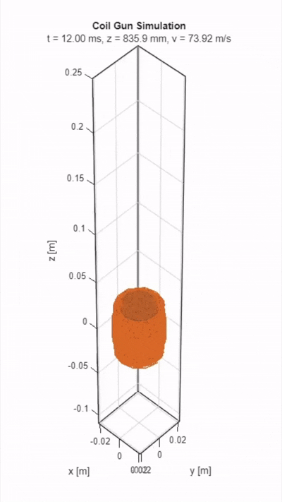
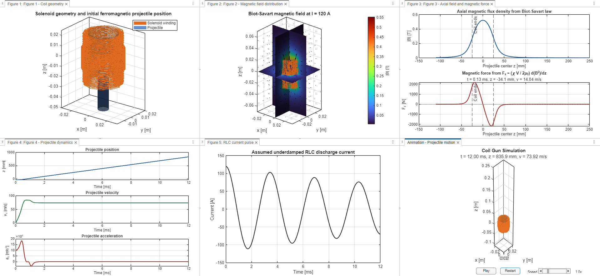

# Single-Stage Coil Gun Electromagnetics Simulation

This MATLAB R2025b project simulates a laboratory-scale single-stage solenoid coil gun as an electromagnetics teaching model. It is intended for a university physics project or article draft, not as a weapon design optimizer.

## Simulation Previews

**Projectile Animation**   
*(Real-time kinematic acceleration of the ferromagnetic projectile traversing the coil)*

**Comprehensive Simulation Dashboard**   
*(Combined view showing 3D coil geometry, Biot-Savart magnetic field distribution, underdamped RLC current pulse, and projectile dynamics)*

## What the Simulation Demonstrates

- A finite solenoid represented by discrete circular current loops.
- Magnetic flux density computed numerically from the Biot-Savart law:

  ```text
  dB = (mu0 I / 4 pi) (dl x r) / |r|^3
  ```

- An underdamped RLC capacitor-discharge current approximation:

  ```text
  I(t) = I0 exp(-R t / 2L) cos(w t)
  w = sqrt(1/(LC) - R^2/(4L^2))
  ```

- A simplified linear ferromagnetic projectile model:

  ```text
  U = -(chi V / 2 mu0) B^2
  Fz = (chi V / 2 mu0) d(B^2)/dz
  ```

- Projectile dynamics from Newton's law:

  ```text
  m d2z/dt2 = Fz(z,t)
  ```

## Files

- `main.m` runs the complete simulation and creates all figures.
- `parameters.m` stores all physical and numerical assumptions.
- `coil_geometry.m` discretizes the solenoid into current elements.
- `current_model.m` evaluates the RLC current pulse.
- `biot_savart_field.m` computes magnetic flux density vectors.
- `magnetic_force.m` computes the axial field-energy force model.
- `projectile_motion.m` integrates projectile motion with `ode45`.
- `visualization.m` creates figures and animation.
- `article_outline.md` gives a physics article structure.

## Default Assumptions

Projectile:

- Mass: 5 g
- Length: 3 cm
- Radius: 5 mm
- Relative permeability: 200
- Linear constant-permeability model

Coil:

- Radius: 1.5 cm
- Length: 5 cm
- Turns: 100
- 48 Biot-Savart segments per turn

Electrical pulse:

- Peak current: 120 A
- Resistance: 0.08 ohm
- Inductance: 1 mH
- Capacitance: 300 uF

## Running

Open MATLAB in this folder and run:

```matlab
cd CoilGunSimulation
main
```

The script generates:

1. 3D coil geometry with projectile.
2. 3D magnetic field vectors and field magnitude slices.
3. Axial magnetic field and magnetic force curves.
4. Projectile position, velocity, and acceleration.
5. An animation of projectile motion through the coil, with pause/play, restart, and playback-speed controls.

## Animation Controls

The animation window includes:

- `Pause` / `Play` to stop and continue projectile motion.
- `Restart` to return to the first frame and replay.
- `Speed` slider from 0.25x to 4x.

The solenoid is rendered as a copper-colored helical tube with a faint bobbin, while the electromagnetic calculation still uses the discrete Biot-Savart current elements. Visual-only rendering parameters are in `parameters.m` under `p.visualization`.

## Multilayer Coil Algorithm

The coil geometry treats `p.coil.radius` as the centerline radius of the innermost winding layer. The code then computes an axial pitch from:

```text
pitch = 2*wireRadius + insulationGap
```

The number of turns that fit in one layer is:

```text
turnsPerLayer = floor(coilLength / pitch)
```

If the requested turn count exceeds one layer, additional turns are placed on outer layers with radius:

```text
layerRadius = innerRadius + (layerIndex - 1)*pitch
```

This same multilayer layout is used both for the visual helical tube and for the Biot-Savart circular loop positions, so high-turn simulations no longer show a single unrealistically compressed winding.

## Physical Interpretation

The magnetic field is strongest inside and near the center of the solenoid. The force is positive when the projectile starts before the coil center because the field magnitude increases in the positive z direction. After the center, the gradient reverses, so the magnetic force tends to pull the projectile back toward the high-field region. This illustrates why timing and field gradients matter in pulsed electromagnetic acceleration.

## Model Limitations

This is a physics-oriented educational model. It deliberately omits magnetic saturation, hysteresis, eddy currents, thermal effects, switching electronics, contact friction, air drag, projectile demagnetization factors, and full finite-element material coupling. These omissions keep the link between Biot-Savart fields, magnetic energy, force, and Newtonian dynamics transparent.
